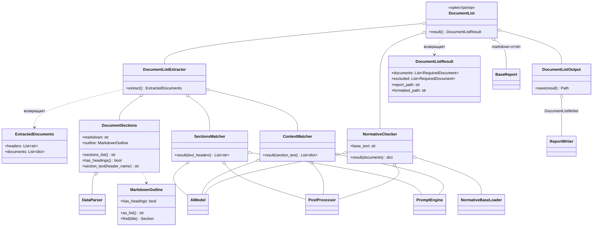
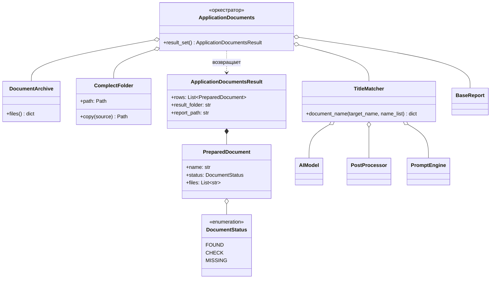
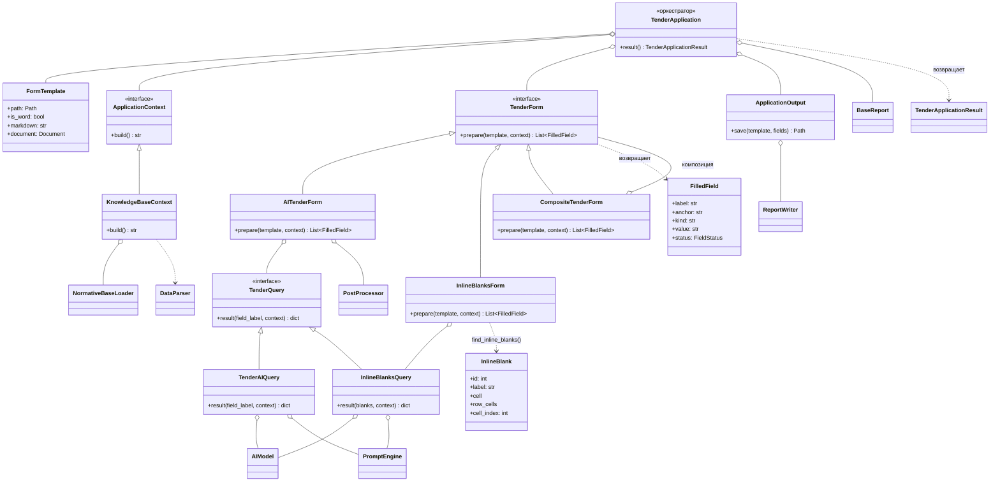

# Tender Assistant

Ассистент подготовки конкурсной (тендерной) заявки. Читает документацию заказчика,
определяет перечень необходимых документов, собирает их из архива организации
и заполняет шаблон заявки данными из базы знаний.

Работа разбита на три независимо запускаемых этапа, связанных по данным:

| Этап | Что делает | Результат |
| --- | --- | --- |
| 1. Список документов | Находит в требованиях раздел с перечнем документов и разбирает его, проверяя по нормативной базе | `document_list_*.md` + `Перечень документов_*.docx` |
| 2. Подготовка документов | Ищет в архиве файлы по смыслу названий и копирует их в папку заявки | `documents_status_*.md` + папка комплекта |
| 3. Подготовка заявки | Построчно заполняет шаблон заявки и размечает поля цветом | `<шаблон>_заполнено.docx` + `application_fill_*.md` |

---

## Как это работает

### Этап 1. Перечень документов

Документ с требованиями (`.docx` / `.pdf` / `.xlsx`) приводится к markdown и
раскладывается на разделы. Заголовки разделов распознаются двумя способами:

1. **Стилевые заголовки** — `Heading 1..4` в Word, страницы в PDF, листы в Excel.
2. **Нумерованные абзацы** — `3.1.`, `РАЗДЕЛ 2`, `ПРИЛОЖЕНИЕ N 1`. Тендерная
   документация сплошь и рядом верстается без стилей заголовков, поэтому иначе
   у документа не было бы структуры вообще.

Эвристика по п. 2 включается только тогда, когда стилевых заголовков нет ни одного —
корректно размеченный документ она не трогает.

Дальше LLM ищет среди заголовков тот, что относится к перечню документов —
**по смыслу, а не по совпадению слов**: раздел может называться «Состав заявки»,
«Требования к содержанию заявки», «Приложения к заявке». Найденный раздел читается
повторно, и модель подтверждает, что там действительно документы
(поле `is_document_list`), после чего выписывает перечень.

Ветки-предохранители, соответствующие схеме работы:

- заголовков в документе нет → документ читается целиком;
- заголовок найден, но перечня документов в разделе нет → документ читается целиком.

Полученный перечень проверяется по нормативной базе организации: из него убираются
документы, которые к нам не относятся (например, требуемые от ИП, когда участник —
юридическое лицо). Исключённое не удаляется молча, а попадает в отчёт с причиной.
Если модель отбросила вообще всё — возвращается исходный перечень: пустой
результат почти всегда её ошибка, а не свойство документа.

Результат этапа сохраняется в двух видах, а не одном: `document_list_*.md` —
машиночитаемый диагностический лог (источник раздела, что исключено и почему),
и `Перечень документов_*.docx` — оформленный документ с нумерованной таблицей
требований и отдельной таблицей исключённого, который можно приложить к заявке
или отправить на согласование. Оба пишутся всегда — второй не заменяет первый.

### Этап 2. Подготовка документов

Папка архива обходится рекурсивно, и для каждого документа из перечня LLM
подбирает подходящий файл по смыслу имени: `Выписка из ЕГРЮЛ` →
`Выписка ЕГРЮЛ 2026-07-14.pdf`.

Имена файлов из ответа модели сверяются с реально существующими — выдуманные
отбрасываются. Найденные файлы копируются в папку комплекта; совпадение имён
не приводит к перезаписи (к имени добавляется счётчик).

Статус в отчёте:

| Статус | Когда проставляется |
| --- | --- |
| **Есть** | Уверенное совпадение (`confidence: high`) и ровно один файл-кандидат |
| **Проверить** | Неуверенное совпадение либо несколько кандидатов — решение за человеком |
| **Нет** | Подходящий файл в архиве не найден |

### Этап 3. Подготовка заявки

Материалы для заполнения — база знаний (эталонные заявки, реквизиты) плюс
требования тендера: часть данных заявки содержится именно в файле требований
из этапа 1.

Шаблон заполняется **двумя независимыми заполнителями**, потому что поля в
формах устроены принципиально по-разному:

1. **Построчный** (`AITenderForm`) — «метка в одной ячейке, значение в
   соседней». Шаблон приводится к markdown, модель выделяет поля, каждое
   заполняется отдельным запросом.
2. **Инлайн-пропуски** (`InlineBlanksForm`) — несколько разных по смыслу
   пропусков внутри одного абзаца:

   > 15.1 `___` (наименование участника закупки) имеет право на ведение
   > деятельности в соответствии с законодательством `___` (наименование
   > государства по месту нахождения) и `___` (наименование государства по
   > месту исполнения договора).

   В плоском markdown такие пропуски неразличимы, поэтому детектор работает
   по объектной модели docx и адресует каждый отдельно. Метка поля берётся
   из поясняющей скобки справа от пропуска. Все пропуски шаблона уходят
   **одним пакетным запросом**: их бывает больше десятка, а по вызову на
   каждый — столько же сетевых round-trip'ов даже при включённом кэше.

Оба заполнителя складываются через `CompositeTenderForm` — включить или
выключить любой из них значит добавить или не добавить его в композицию.

**Текст шаблона не переписывается.** Значения пишутся в отдельное поле:
построчные — в ячейку значения, инлайн-пропуски — в колонку справа от текста
требования, под подсказку шаблона («Да» / «Нет»). Формулировки требований и
сами `___` остаются нетронутыми — правка в тексте была бы незаметной при
вычитке. Переносит значения в текст человек.

| Цвет | Статус | Значение |
| --- | --- | --- |
| 🟢 Зелёный | `found` | Найдено дословно и однозначно |
| 🟡 Жёлтый | `check` | Найдено косвенно, устарело или есть варианты — проверить |
| 🔴 Красный | `missing` | Информации нет; пишется `НЕ НАЙДЕНО` |

Поля, которым не нашлось места (нет ячейки справа, не сошёлся якорь),
выносятся отдельным блоком в конец файла — они не теряются. Шаблон в PDF
заполнить нельзя, поэтому для него результат выгружается в отдельный `.docx`.

---

## Установка

Нужен Python 3.10+.

```bash
python -m venv .venv
.venv\Scripts\activate        # Windows
# source .venv/bin/activate   # Linux / macOS

pip install -r requirements.txt
cp .env.example .env
```

В `requirements.txt` перечислены SDK всех поддерживаемых провайдеров, но
импортируются они лениво — фактически нужен только тот, что указан
в `AI_PROVIDER`. Лишние строки можно удалить.

## Настройка

Все параметры читаются из `.env` или переменных окружения — см. `.env.example`.

```env
AI_PROVIDER=gemini          # gemini | anthropic | ollama | qwen | vsk
GEMINI_API_KEY=...
AI_MODEL_NAME=gemini-2.0-flash
AI_TEMPERATURE=0.2
RESULTS_ROOT=results        # куда писать отчёты, если путь не задан в запросе
```

**Контекстное окно.** Объёмная база знаний может не влезть в промпт. Если окно
ограничено, `PromptEngine` разбивает базу на разделы и подставляет только
релевантные запросу. Размер окна выбирается так:

1. `PROMPT_CONTEXT_WINDOW`, если задан явно;
2. иначе `LLM_NUM_CTX` — для провайдеров на своём железе (`ollama`, `qwen`);
3. иначе без ограничения — облачным моделям промпт не режется.

## Запуск

```bash
uvicorn main:app --reload
# либо: python main.py
```

Документация API: <http://localhost:8000/docs>

### Запуск в Docker

```bash
cp .env.example .env        # заполнить ключи провайдера
docker compose up -d --build
```

Сервис поднимется на `http://localhost:8000` (порт меняется через `API_PORT`).
`docker-compose.yml` читает `.env` — переменные оттуда перекрывают значения
по умолчанию, прописанные в compose.

Каталоги данных монтируются с хоста и создаются при первом запуске:

| Том на хосте | Внутри контейнера | Что кладём |
| --- | --- | --- |
| `./tenders` | `/app/tenders` | Требования тендера и шаблоны заявок |
| `./documents` | `/app/documents` | Архив документов организации |
| `./normative_base` | `/app/normative_base` | Нормативная база (этап 1) |
| `./knowledge_base` | `/app/knowledge_base` | Эталонные заявки и реквизиты (этап 3) |
| `./results` | `/app/results` | Перечень, комплект, заполненная заявка |

**Важно про пути.** Сервис читает и пишет файлы по абсолютным путям из тела
запроса, и разрешаются они **внутри контейнера**. Поэтому клиент присылает
`/app/tenders/requirements.docx`, а не `D:\...\requirements.docx` — иначе
получите `400 Файл не найден`. Для настольного интерфейса это означает, что
без общей файловой системы он с контейнером не работает: либо запускайте
сервис локально, либо сопоставляйте пути на стороне GUI.

Таймаут выставлен в 3600 секунд: этап 3 — это десятки последовательных
запросов к LLM, один прогон на реальной документации занимает 5–10 минут.

### `POST /api/update`

Полный цикл всех трёх этапов.

```json
{
  "message_id": 42,
  "file_path": "D:/tenders/44-2026/requirements.docx",
  "documents_folder_path": "D:/company/documents",
  "results_path": "D:/tenders/44-2026/result",
  "application_template_path": "D:/tenders/44-2026/form.docx",
  "normative_base_folder": "D:/company/normative",
  "knowledge_base_folder": "D:/company/reference_applications",
  "result_folder_name": "komplekt"
}
```

| Поле | Обяз. | Назначение |
| --- | --- | --- |
| `message_id` | да | ID запроса в базе данных |
| `file_path` | да | Файл с требованиями тендера (этапы 1 и 3) |
| `documents_folder_path` | да | Архив документов организации (этап 2) |
| `results_path` | да | Куда складывать отчёты и результаты |
| `application_template_path` | да | Шаблон заявки для заполнения (этап 3) |
| `normative_base_folder` | нет | Нормативная база для проверки перечня (этап 1) |
| `knowledge_base_folder` | нет | Эталонные заявки и реквизиты (этап 3); при отсутствии берётся `normative_base_folder` |
| `result_folder_name` | нет | Подпапка в `results_path` под комплект документов |

Ответ — `AssistantResult` с результатами трёх этапов: перечень документов
(включая исключённое), таблица статусов файлов, список заполненных полей
и пути ко всем созданным файлам.

`GET /api/health` — проверка живости сервиса.

## Настольный интерфейс

Помимо API есть GUI на edifice/PySide6 — обёртка над тем же `POST /api/update`.

```bash
pip install -r app/requirements.txt
python app/main.py            # сервис должен быть уже запущен
```

Окно собирает шесть путей — требования тендера, папку с документами, шаблон
заявки, нормативную базу, базу знаний и папку результатов, — отправляет их
одним запросом и показывает сводку по трём этапам: сколько документов
требуется, сколько файлов найдено (Есть / Проверить / Нет), сколько полей
заявки заполнено. Кнопки открывают собранный комплект, заполненную заявку
и отчёты.

Адрес сервиса задаётся в `app/config.json`:

```json
{ "api_base_url": "http://localhost:8000", "request_timeout": 3600 }
```

Файлы никуда не копируются перед отправкой: сервис читает их по указанным
путям, поэтому GUI и сервис должны видеть одну файловую систему.

## Поддерживаемые форматы

| Формат | Чтение | Заполнение шаблона |
| --- | --- | --- |
| `.docx` / `.doc` | да | да |
| `.xlsx` / `.xlsm` / `.xls` | да | да |
| `.pdf` | да | нет — выгрузка в `.docx` |
| `.md` / `.txt` / `.csv` | только база знаний | — |

---

## Структура проекта

```
main.py                          FastAPI: эндпоинты и обработка ошибок
app/main.py                      Настольный интерфейс (edifice/PySide6)
tender_assistant/
├── services/assistant.py        Оркестратор: собирает и запускает три этапа
├── documents/
│   ├── document_list.py         Этап 1: разделы → перечень → проверка по норме
│   └── application_documents.py Этап 2: поиск файлов и сбор комплекта
├── application/application.py   Этап 3: шаблон, материалы, заполнители, сохранение
├── ai/
│   ├── model.py                 Провайдеры LLM + retry-логика, ModelFactory
│   ├── promt_builders.py        Сборка промпта, загрузка базы знаний
│   ├── context_builder.py       Подгонка промпта под контекстное окно
│   └── postprocessor.py         Разбор ответов модели (JSON + текстовый откат)
├── core/
│   ├── config.py                Настройки и все шаблоны промптов
│   ├── parsers.py               Word/Excel/PDF → markdown, MarkdownOutline
│   └── pydantic_models.py       Доменные модели и статусы
├── reports/
│   ├── report_export.py         Сохранение markdown-отчётов
│   ├── writers.py               ReportWriter: заполнение заявки и оформление перечня документов
│   └── style.py                 Палитра статусов
└── models/request.py            Схема входящего запроса

tests/
├── conftest.py                  Фикстуры: синтетическая документация и архив
├── fakes.py                     Фиктивные LLM (ScriptedModel и др.)
├── unit/                        Модульные тесты по слоям
└── integration/                 Сквозной пайплайн, HTTP API, отрисовка GUI
```

## Диаграммы классов

Общий принцип на всех этапах: **класс этапа — оркестратор**, он вызывает
интерфейсы и сам не работает с документами. Зависимости передаются в
конструктор, поэтому любую составляющую можно подменить (чем и пользуются
тесты, подставляя фиктивную LLM вместо настоящей).

### Общая инфраструктура

Эти интерфейсы используют все три этапа.

```mermaid
classDiagram
    class AIModel {
        <<interface>>
        +supports_prompt_caching: bool
        +response(query) str
        +response_with_cache(cache_prefix, query) str
    }
    class ModelFactory {
        <<factory>>
        +create()$ AIModel
    }
    class PostProcessor {
        <<interface>>
        +report(raw_text) Any
    }
    class PromptEngine {
        +render(template, fit_key, fit_query, values) str
    }
    class DataParser {
        +origin_data() str
    }
    class BaseReport {
        +result(report_text) str
    }
    class ReportWriter {
        <<interface>>
        +write(data, output_path, source_path) Path
    }

    ModelFactory ..> AIModel : создаёт
    AIModel <|-- ServiceLLMModel
    ServiceLLMModel <|-- GeminiModel
    ServiceLLMModel <|-- AnthropicModel
    AIModel <|-- OllamaModel
    AIModel <|-- QwenModel
    AIModel <|-- VskAIModel

    PostProcessor <|-- SectionsMatcherResponse
    PostProcessor <|-- DocumentListResponse
    PostProcessor <|-- NormativeFilterResponse
    PostProcessor <|-- TitleMatcherPostProcessor
    PostProcessor <|-- FormFieldsResponse
    PostProcessor <|-- TenderRowPostProcessor
    PostProcessor <|-- InlineBlanksResponse

    Parser <|-- Word
    Parser <|-- Excel
    Parser <|-- PDF
    DataParser o-- Parser

    BaseReport <|-- DocumentListReport
    BaseReport <|-- ApplicationDocumentsReport
    BaseReport <|-- TenderApplicationReport

    ReportWriter <|-- WordApplicationWriter
    ReportWriter <|-- ExcelApplicationWriter
    ReportWriter <|-- TenderReportWriter
    ReportWriter <|-- DocumentListWriter
```



`AnthropicModel` — единственная реализация с `supports_prompt_caching = True`;
у остальных `response_with_cache` по умолчанию просто склеивает префикс с
запросом (см. «Стоимость этапа 3»).

### Этап 1. Перечень документов



`DocumentListExtractor` объединяет три шага схемы работы — найти заголовки,
выбрать раздел про документы, прочитать его. Порознь они бессмысленны:
результат каждого нужен только следующему.

### Этап 2. Подготовка документов



### Этап 3. Подготовка заявки



Ключевое здесь — `CompositeTenderForm`, реализующий тот же `TenderForm`, что и
его составляющие: оркестратор видит один заполнитель и не знает, что внутри их
два. Список полей от обоих складывается и уходит в `ApplicationOutput` единым
набором.

## Тесты

```bash
pip install -r requirements-dev.txt

pytest                      # всё
pytest tests/unit           # только модульные
pytest -m integration       # только сквозные
```

Тесты не обращаются к настоящей LLM: она платная, медленная и
недетерминированная. Вместо неё — `ScriptedModel` из `tests/fakes.py`,
отвечающая в зависимости от того, какой маркер раздела найден в промпте
(`### ЗАГОЛОВКИ`, `### ТРЕБУЕМЫЙ ДОКУМЕНТ`, …). Побочный полезный эффект:
тест заодно проверяет, что применён нужный шаблон промпта и в него попали
нужные данные. Есть также `SequenceModel` (ответы по порядку) и `BrokenModel`
(всегда мусор — проверка устойчивости постпроцессоров).

Входные документы — Word и Excel — собираются фикстурами на лету во временном
каталоге, поэтому бинарных файлов в репозитории нет и тесты ничего не пишут
в рабочую папку.

Что покрыто помимо happy path: ветки деградации (нет заголовков, раздел без
перечня, пустой архив, отсутствующая база знаний), выдуманные моделью имена
файлов и заголовки, ответы не в JSON, коды ошибок API (`422` на невалидный
запрос, `400` на отсутствующий или неподдерживаемый файл, `502` на сбой
провайдера LLM).

Интерфейс покрыт двумя способами: контрактным тестом (payload из GUI обязан
проходить валидацию `APIRequest` — иначе рассинхрон вылезет только в рантайме)
и отрисовкой вне экрана через `QT_QPA_PLATFORM=offscreen`, которая ловит
ошибки в теле render. Если PySide6 и edifice не установлены, эти тесты
пропускаются, а не падают.

### Устойчивость к ответам модели

Все промпты требуют JSON, но модели своевольничают. `JsonExtractor` вытаскивает
ответ из ```` ```json ````-обрамления, преамбул («Вот результат:»), блоков
`<think>`, корректно обрабатывая скобки внутри строк. Если JSON не разобрался,
постпроцессор откатывается к разбору нумерованного или маркированного текста.
Пустой или неожиданный ответ не роняет пайплайн — он даёт статус «Проверить».

Сетевые сбои и перегрузка провайдера обрабатываются в `ServiceLLMModel`:
до 3 повторов при `503` / `429` / пустом ответе, у Anthropic — с учётом
заголовка `retry-after`.

### Стоимость этапа 3: prompt caching

Заполнение заявки — десятки отдельных запросов (по одному на поле шаблона),
и все они опираются на одни и те же материалы (базу знаний и требования
тендера). Без кэширования эти материалы отправлялись бы заново на каждое
поле: на документе Rosatom-класса (~200 000 символов) это ≈ 82 000 токенов
контекста **на вызов** — 47 полей превращаются в ~3,9 млн входных токенов
за один прогон.

`AIModel.response_with_cache(cache_prefix, query)` — интерфейс для
провайдеров, умеющих переиспользовать общий префикс. У Anthropic
(`AnthropicModel.supports_prompt_caching = True`) материалы уходят отдельным
content-блоком с `cache_control`: первый вызов — по полной цене, следующие
в течение ~5 минут — по цене чтения кэша (на порядок дешевле). У остальных
провайдеров `response_with_cache` по умолчанию просто склеивает префикс
с запросом — поведение не меняется.

Обратная сторона: кэш работает только на точном совпадении префикса, поэтому
для кэширующих моделей `TenderAIQuery` отправляет материалы целиком, без
обрезки под конкретное поле. Для self-hosted провайдеров (`ollama`, `qwen`,
`supports_prompt_caching = False`) обрезка под поле (`fit_key`/`fit_query`,
см. выше) сохраняется — у них нет кэша, зато есть реально маленькое окно,
которое иначе просто переполнится.

## Точки расширения

| Задача | Что сделать |
| --- | --- |
| Добавить провайдера LLM | Реализовать `AIModel` (или `ServiceLLMModel` ради retry) в `ai/model.py` и зарегистрировать в `ModelFactory` |
| Включить prompt caching у другого провайдера | Переопределить `response_with_cache` и выставить `supports_prompt_caching = True` в `ai/model.py`, по образцу `AnthropicModel` |
| Поддержать новый формат файлов | Реализовать `Parser` в `core/parsers.py` и добавить расширение в `DataParser._SUPPORTED` |
| Изменить формат заполнения заявки | Реализовать `ReportWriter` в `reports/writers.py` и зарегистрировать в `TenderReportWriter._WRITERS` |
| Добавить формат оформленного перечня документов (например, Excel) | Реализовать `ReportWriter` в `reports/writers.py` по образцу `DocumentListWriter` и передать в `DocumentList(writer=...)` |
| Научиться распознавать поля нового вида | Реализовать `TenderForm` в `application/application.py` и добавить в `CompositeTenderForm` (в `services/assistant.py`) — существующие заполнители трогать не нужно |
| Брать документы не из папки (S3, СЭД) | Реализовать `files()` по образцу `DocumentArchive` и передать в `ApplicationDocuments(archive=...)` |
| Собирать комплект иначе (архив, загрузка) | Реализовать `path`/`copy()` по образцу `ComplectFolder` и передать в `ApplicationDocuments(complect=...)` |
| Взять материалы из другого источника (CRM, БД) | Реализовать `ApplicationContext.build()` в `application/application.py` и передать в `TenderApplication(context=...)` |
| Отключить заполнитель | Убрать его из списка `CompositeTenderForm` — флагов и `if` внутри оркестратора для этого нет |
| Поправить поведение модели | Промпты собраны в `core/config.py` — код менять не нужно |

Этапы связаны только через оркестратор `TenderAssistantService`; зависимости
передаются в конструкторы, поэтому любой этап можно запустить отдельно или
подменить его составляющие (например, заменить LLM-поиск файлов на поиск
по правилам).
